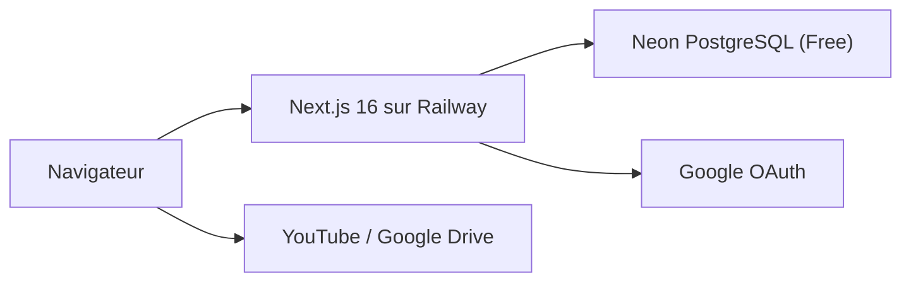
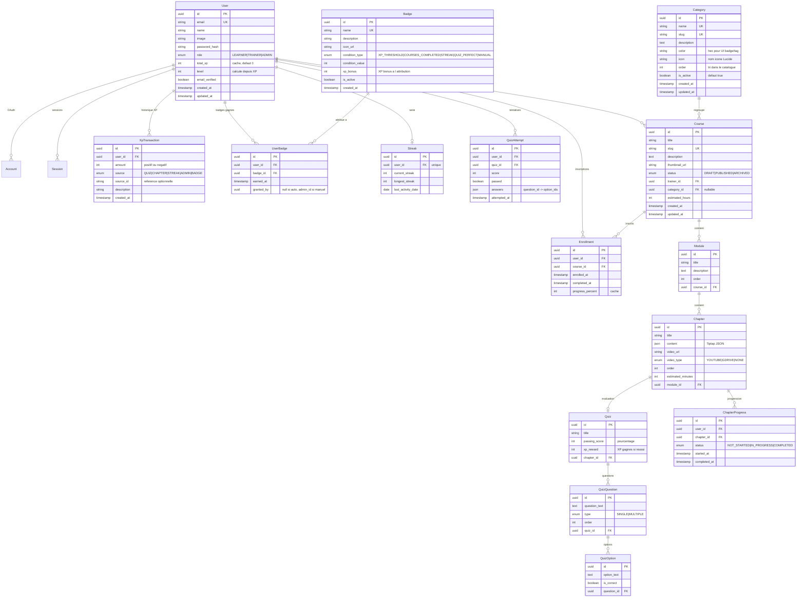

# Architecture Akaa - Plateforme E-Learning Gamifiee

## Contexte technique actuel

Le projet est un scaffold Next.js 16.2.2 vierge avec les dependances deja installees :

- **Runtime** : Next.js 16.2.2, React 19.2.4, TypeScript 5
- **Styling** : Tailwind CSS v4 (via PostCSS, CSS-first config dans `globals.css`)
- **ORM** : Prisma 7.6.0 + @prisma/client (non configure)
- **Auth** : NextAuth v5 beta 30 + @auth/prisma-adapter (non configure)
- **Utilitaires** : React Query, Zod 4, Framer Motion, Lucide React, bcryptjs, date-fns

Aucun code applicatif n'existe. Les 3 fichiers dans `src/app/` sont le template par defaut.

---

## Infrastructure cible




- **App** : Next.js sur Railway (Hobby plan - 8 Go RAM, 8 vCPU)
- **BDD** : Neon PostgreSQL Free (0.5 Go, 190h compute/mois, auto-suspend)
- **Media** : YouTube/Google Drive embed (zero stockage cote serveur)
- **Auth** : NextAuth v5 avec Google OAuth + credentials (email/password)

---

## Schema de base de donnees PostgreSQL

Les tables sont regroupees en 4 domaines. Points critiques :

- `xp_transaction` et `user_badge` sont relies a `user` via `user_id` (FK + index)
- Le total XP d'un utilisateur = `SUM(xp_transaction.amount)` + champ cache `user.total_xp`
- Les badges sont geres par l'admin, attribues automatiquement ou manuellement
- Les categories sont gerees par l'admin, chaque cours peut etre rattache a une categorie
- `course.category_id` -> `category.id` (FK nullable, ON DELETE SET NULL) + index sur `category_id`




### Relations critiques XP/Badges <-> User

- `xp_transaction.user_id` -> `user.id` (ON DELETE CASCADE) + index sur `user_id`
- `user_badge.user_id` -> `user.id` (ON DELETE CASCADE) + index composite `(user_id, badge_id)` UNIQUE
- `user_badge.badge_id` -> `badge.id` (ON DELETE CASCADE)
- `user.total_xp` est un champ denormalise, mis a jour via trigger ou logique applicative a chaque insertion dans `xp_transaction`
- `user.level` est calcule : `floor(total_xp / 100) + 1` (configurable)

---

## Structure des dossiers

```
akaa/
├── prisma/
│   ├── schema.prisma          # Schema complet Prisma
│   ├── seed.ts                # Donnees de seed (badges, admin, cours demo)
│   └── migrations/            # Genere par prisma migrate
├── src/
│   ├── app/
│   │   ├── (auth)/            # Route group : login/register
│   │   │   ├── login/page.tsx
│   │   │   ├── register/page.tsx
│   │   │   └── layout.tsx     # Layout minimal sans sidebar
│   │   ├── (platform)/        # Route group : espace apprenant
│   │   │   ├── dashboard/page.tsx
│   │   │   ├── courses/
│   │   │   │   ├── page.tsx                    # Catalogue (filtrable par categorie)
│   │   │   │   └── [slug]/
│   │   │   │       ├── page.tsx                # Detail cours
│   │   │   │       └── learn/
│   │   │   │           └── [chapterId]/page.tsx # Lecteur chapitre
│   │   │   ├── leaderboard/page.tsx
│   │   │   ├── profile/page.tsx
│   │   │   └── layout.tsx     # Sidebar + header avec XP/avatar
│   │   ├── (trainer)/         # Route group : espace formateur
│   │   │   ├── trainer/
│   │   │   │   ├── dashboard/page.tsx
│   │   │   │   ├── courses/
│   │   │   │   │   ├── page.tsx
│   │   │   │   │   ├── new/page.tsx
│   │   │   │   │   └── [courseId]/
│   │   │   │   │       └── edit/page.tsx      # Editeur complet
│   │   │   │   └── layout.tsx
│   │   ├── (admin)/           # Route group : espace admin
│   │   │   ├── admin/
│   │   │   │   ├── dashboard/page.tsx
│   │   │   │   ├── users/page.tsx
│   │   │   │   ├── courses/page.tsx
│   │   │   │   ├── categories/page.tsx         # CRUD categories
│   │   │   │   ├── badges/page.tsx            # CRUD badges
│   │   │   │   ├── xp/page.tsx                # Gestion XP manuelle
│   │   │   │   └── layout.tsx
│   │   ├── api/
│   │   │   └── auth/[...nextauth]/route.ts
│   │   ├── layout.tsx         # Root layout
│   │   ├── page.tsx           # Landing page
│   │   └── globals.css
│   ├── components/
│   │   ├── ui/                # Composants shadcn/ui
│   │   ├── auth/              # LoginForm, RegisterForm, GoogleButton
│   │   ├── course/            # CourseCard, ChapterViewer, VideoEmbed, CategoryFilter
│   │   ├── quiz/              # QuizPlayer, QuestionCard, ResultScreen
│   │   ├── dashboard/         # StatsCards, ProgressChart, Calendar
│   │   ├── gamification/      # XPBar, BadgeCard, StreakCounter, Leaderboard
│   │   ├── editor/            # RichTextEditor (Tiptap), CourseBuilder
│   │   └── layout/            # Sidebar, Header, MobileNav
│   ├── lib/
│   │   ├── auth.ts            # Config NextAuth v5
│   │   ├── db.ts              # Singleton PrismaClient
│   │   ├── gamification.ts    # Logique XP, badges, streaks, niveaux
│   │   ├── utils.ts           # Helpers generiques (cn, formatDate...)
│   │   └── validations/       # Schemas Zod par domaine
│   │       ├── auth.ts
│   │       ├── course.ts
│   │       ├── category.ts
│   │       └── quiz.ts
│   ├── hooks/                 # useCurrentUser, useXP, useCourseProgress
│   ├── actions/               # Server Actions par domaine
│   │   ├── auth.ts
│   │   ├── courses.ts
│   │   ├── quiz.ts
│   │   ├── gamification.ts
│   │   └── admin.ts
│   └── types/                 # Types TypeScript partages
│       └── index.ts
├── public/
│   ├── badges/                # Icones de badges (SVG)
│   └── images/
├── .env.local                 # Variables d'environnement (non commit)
├── .cursor/
│   └── rules/
│       ├── stack.mdc          # Conventions Next.js / Tailwind / PostgreSQL
│       └── ux.mdc             # Regles UX et gamification
├── ARCHITECTURE.md            # Document d'architecture complet
└── ... (configs existantes)
```

---

## Roles et permissions


| Action                  | Apprenant | Formateur | Admin |
| ----------------------- | --------- | --------- | ----- |
| Voir cours publies      | Oui       | Oui       | Oui   |
| S'inscrire a un cours   | Oui       | Oui       | Oui   |
| Suivre chapitres + quiz | Oui       | Oui       | Oui   |
| Gagner XP / badges      | Oui       | Oui       | Oui   |
| Creer/editer ses cours  | Non       | Oui       | Oui   |
| Voir stats de ses cours | Non       | Oui       | Oui   |
| Gerer tous les cours    | Non       | Non       | Oui   |
| Gerer utilisateurs      | Non       | Non       | Oui   |
| CRUD categories         | Non       | Non       | Oui   |
| CRUD badges             | Non       | Non       | Oui   |
| Ajuster XP manuellement | Non       | Non       | Oui   |


---

## Fichiers a produire

### 1. [ARCHITECTURE.md](ARCHITECTURE.md)

Document complet reprenant toutes les sections ci-dessus + :

- Vision produit et contraintes
- Diagramme d'architecture infrastructure
- Schema de BDD complet avec commentaires sur les relations XP/Badges <-> User
- Regles de gamification (formules XP, seuils de niveaux, conditions de badges)
- Plan d'implementation phase par phase
- Contraintes Neon DB free tier

### 2. [.cursor/rules/stack.mdc](.cursor/rules/stack.mdc)

Conventions strictes :

- Next.js 16 App Router : Server Components par defaut, Server Actions pour mutations, pas de `"use client"` sauf necessaire
- Prisma 7 : schema unique, relations explicites, index sur FK
- Tailwind v4 : CSS-first config, pas de tailwind.config.js, design tokens dans globals.css
- Zod 4 pour validation, React Query pour cache client
- Conventions de nommage, structure des fichiers, patterns d'erreur

### 3. [.cursor/rules/ux.mdc](.cursor/rules/ux.mdc)

Regles d'interface engageante :

- Palette de couleurs gamifiee (accent vibrant, gradients subtils)
- Animations Framer Motion : feedback immediat sur les actions (XP gained, badge unlock)
- Micro-interactions : progress bars animees, confetti sur completion, shake sur erreur
- Composants de gamification : XP pill dans le header, streak flame, badge showcase
- Mobile-first, accessibilite FR
- Hierarchie visuelle : dashboard comme hub central avec stats hero

---

## Plan d'implementation (phases)

**Phase 1 - Fondations** : Prisma schema + migrations, config NextAuth (Google + credentials), middleware de roles, PrismaClient singleton, .env.local

**Phase 2 - Auth et Layout** : Pages login/register, layouts par route group (auth, platform, trainer, admin), sidebar, header avec XP

**Phase 3 - Cours** : CRUD cours/modules/chapitres cote formateur, editeur rich text (Tiptap), embed video YouTube/GDrive, catalogue et lecteur cote apprenant

**Phase 4 - Quiz et Progression** : Systeme de quiz QCM, tracking progression chapitre, calcul pourcentage cours

**Phase 5 - Gamification** : Moteur XP (events -> transactions -> total cache), systeme de badges (auto + admin), streaks, leaderboard, animations

**Phase 6 - Admin** : Dashboard admin, gestion utilisateurs, CRUD categories, CRUD badges, ajustement XP manuel, stats globales

**Phase 7 - Polish** : Landing page, responsive, animations, SEO, performance, seed data